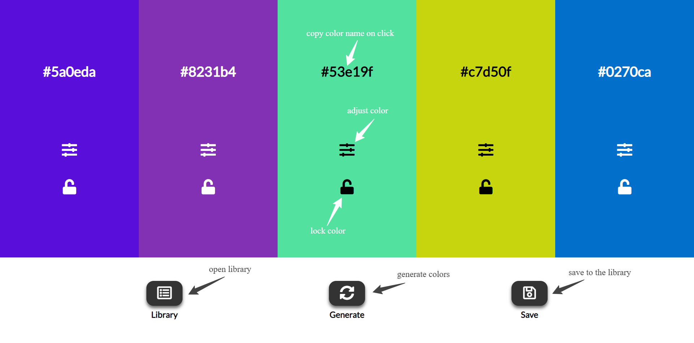

# Project Random Color-Palette

I don't know why I built it... just for fun.
We can generate random hex colors and use them for any reason. We can copy the hex name of any numbers generated if we want. We can save palettes to the library and use them afterwards.
Maximim length of a palette name, when saving it to the library, is 10 symbols.

I used the localStorage API to save palettes even when we accidentaly (or on purpose) close the page or browser.
Also used the chroma.js library that helped with adjusting colors a lot. Check it [here](https://yar1991.github.io/Random-Color-Palette/).

## Technologies:

- HTML
- CSS
  - SASS
- Javascript:
  - chroma.js

## A screenshot/instruction:

